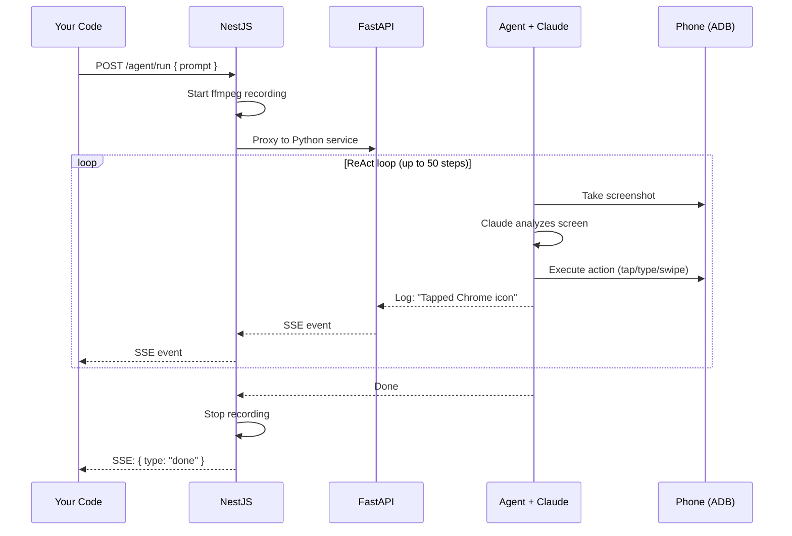
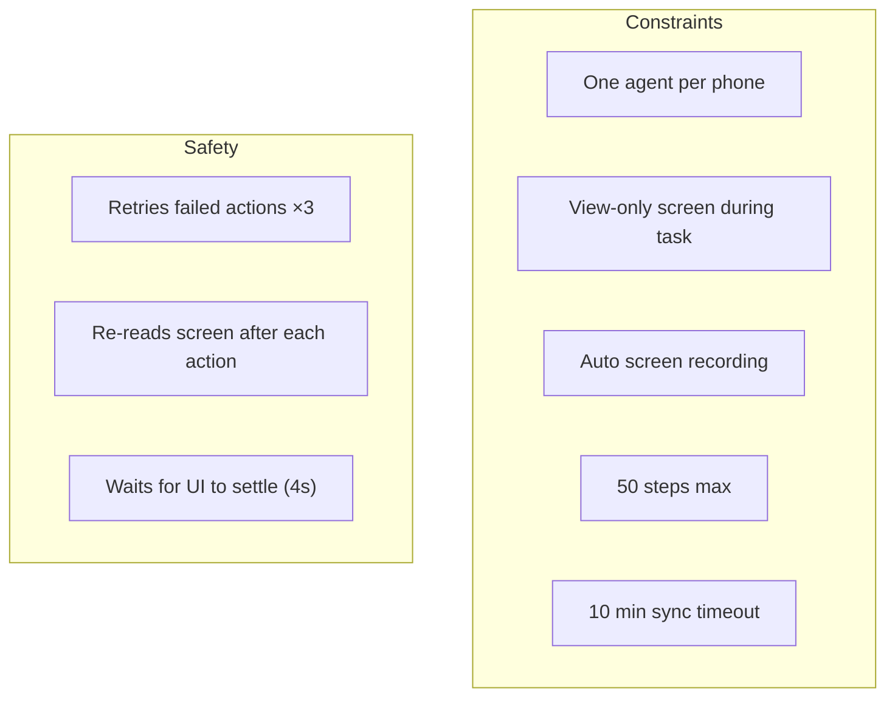

# Agent API

Control the AI agent that operates phones.

### How agent execution works



### SSE event flow


---

## Run Task — Streaming

```
POST /phones/:id/agent/run
```

Starts an AI task and returns a **Server-Sent Events (SSE)** stream. Events arrive in real-time as the agent works.

**Request body:**

| Field | Type | Required | Description |
|-------|------|----------|-------------|
| `prompt` | string | Yes | What the agent should do |
| `taskId` | string | No | Links recording to this task |

**SSE event types:**

| Type | Meaning |
|------|---------|
| `info` | Status update (connecting, initializing) |
| `step` | Agent action or thought |
| `done` | Success — `message` contains the answer |
| `error` | Failure — `message` contains the reason |

<!-- tabs:start -->

#### **Python (sync)**

```python
import requests, time

API = "http://localhost:3000/api/v1"
H = {"X-API-Key": "mas_your_key", "Content-Type": "application/json"}

# Create phone and wait for boot
phone = requests.post(f"{API}/phones", headers=H).json()
while requests.get(f"{API}/phones/{phone['id']}", headers=H).json()["status"] != "ready":
    time.sleep(3)

# Run task (sync — blocks until done)
result = requests.post(
    f"{API}/phones/{phone['id']}/agent/run-sync",
    headers=H,
    json={"prompt": "Open Settings and check the Android version"},
).json()

if result["success"]:
    print(f"Answer: {result['result']}")
    print(f"Steps: {result['stepCount']}")
else:
    print(f"Failed: {result['error']}")

# Cleanup
requests.delete(f"{API}/phones/{phone['id']}", headers=H)
```

#### **Python (streaming)**

```python
import requests, json, time

API = "http://localhost:3000/api/v1"
H = {"X-API-Key": "mas_your_key", "Content-Type": "application/json"}

# Create phone and wait for boot
phone = requests.post(f"{API}/phones", headers=H).json()
while requests.get(f"{API}/phones/{phone['id']}", headers=H).json()["status"] != "ready":
    time.sleep(3)

# Run task (streaming — see each step live)
resp = requests.post(
    f"{API}/phones/{phone['id']}/agent/run",
    headers=H,
    json={"prompt": "Open Settings and check the Android version"},
    stream=True,
)

for line in resp.iter_lines():
    line = line.decode()
    if not line.startswith("data: "):
        continue
    event = json.loads(line[6:])

    if event["type"] == "info":    print(f"  ℹ {event['message']}")
    elif event["type"] == "step":  print(f"  → {event['message']}")
    elif event["type"] == "done":  print(f"  ✓ {event['message']}")
    elif event["type"] == "error": print(f"  ✗ {event['message']}")

# Cleanup
requests.delete(f"{API}/phones/{phone['id']}", headers=H)
```

#### **JavaScript (sync)**

```javascript
const API = "http://localhost:3000/api/v1";
const H = { "X-API-Key": "mas_your_key", "Content-Type": "application/json" };

// Create phone and wait for boot
const phone = await fetch(`${API}/phones`, { method: "POST", headers: H }).then(r => r.json());
while (true) {
  const p = await fetch(`${API}/phones/${phone.id}`, { headers: H }).then(r => r.json());
  if (p.status === "ready") break;
  await new Promise(r => setTimeout(r, 3000));
}

// Run task (sync — blocks until done)
const result = await fetch(`${API}/phones/${phone.id}/agent/run-sync`, {
  method: "POST", headers: H,
  body: JSON.stringify({ prompt: "Open Settings and check the Android version" }),
}).then(r => r.json());

if (result.success) {
  console.log(`Answer: ${result.result}`);
} else {
  console.error(`Failed: ${result.error}`);
}

// Cleanup
await fetch(`${API}/phones/${phone.id}`, { method: "DELETE", headers: H });
```

#### **JavaScript (streaming)**

```javascript
const API = "http://localhost:3000/api/v1";
const H = { "X-API-Key": "mas_your_key", "Content-Type": "application/json" };

// Create phone and wait for boot
const phone = await fetch(`${API}/phones`, { method: "POST", headers: H }).then(r => r.json());
while (true) {
  const p = await fetch(`${API}/phones/${phone.id}`, { headers: H }).then(r => r.json());
  if (p.status === "ready") break;
  await new Promise(r => setTimeout(r, 3000));
}

// Run task (streaming — see each step live)
const resp = await fetch(`${API}/phones/${phone.id}/agent/run`, {
  method: "POST", headers: H,
  body: JSON.stringify({ prompt: "Open Settings and check the Android version" }),
});

const reader = resp.body.getReader();
const decoder = new TextDecoder();
let buffer = "";

while (true) {
  const { done, value } = await reader.read();
  if (done) break;
  buffer += decoder.decode(value, { stream: true });
  const lines = buffer.split("\n");
  buffer = lines.pop();

  for (const line of lines) {
    if (!line.startsWith("data: ")) continue;
    const event = JSON.parse(line.slice(6));
    console.log(`[${event.type}] ${event.message}`);
  }
}

// Cleanup
await fetch(`${API}/phones/${phone.id}`, { method: "DELETE", headers: H });
```

#### **curl**

```bash
# Uses API key header throughout

# Create phone and wait for boot
PHONE=$(curl -s -X POST http://localhost:3000/api/v1/phones \
  -H "X-API-Key: mas_your_key" | jq -r .id)

while [ "$(curl -s http://localhost:3000/api/v1/phones/$PHONE \
  -H "X-API-Key: mas_your_key" | jq -r .status)" != "ready" ]; do
  sleep 3
done

# Run task (sync)
curl -X POST http://localhost:3000/api/v1/phones/$PHONE/agent/run-sync \
  -H "X-API-Key: mas_your_key" \
  -H "Content-Type: application/json" \
  -d '{"prompt": "Open Settings and check the Android version"}'

# Cleanup
curl -X DELETE http://localhost:3000/api/v1/phones/$PHONE \
  -H "X-API-Key: mas_your_key"
```

<!-- tabs:end -->

---

## Run Task — Synchronous

```
POST /phones/:id/agent/run-sync
```

Starts an AI task and **waits** until it completes. Returns a single JSON response. No streaming — the request blocks until the agent finishes (up to 10 minutes).

**Request body:** Same as streaming.

**Response:**

```json
{
  "success": true,
  "result": "The Android version is 16.",
  "steps": ["Opened Settings", "Scrolled to About phone", "Found Android version: 16"],
  "stepCount": 3,
  "error": null
}
```

| Field | Type | Description |
|-------|------|-------------|
| `success` | boolean | `true` if the task completed |
| `result` | string \| null | The answer (on success) |
| `steps` | string[] | All steps the agent took |
| `stepCount` | number | Total step count |
| `error` | string \| null | Error message (on failure) |

> [!TIP]
> Use **streaming** for UIs and dashboards. Use **sync** for scripts and batch jobs.

---

## Reconnect to Active Run

```
GET /phones/:id/agent/stream
```

If your client disconnects mid-task, this replays all buffered events then continues live. Buffers kept for 60 seconds after completion.

<!-- tabs:start -->

#### **Python**

```python
import requests, json

API = "http://localhost:3000/api/v1"
H = {"X-API-Key": "mas_your_key", "Content-Type": "application/json"}

resp = requests.get(f"{API}/phones/phone-1/agent/stream", headers=H, stream=True)
for line in resp.iter_lines():
    line = line.decode()
    if line.startswith("data: "):
        event = json.loads(line[6:])
        print(f"[{event['type']}] {event['message']}")
```

#### **JavaScript**

```javascript
const API = "http://localhost:3000/api/v1";
const H = { "X-API-Key": "mas_your_key", "Content-Type": "application/json" };

const resp = await fetch(`${API}/phones/phone-1/agent/stream`, { headers: H });
const reader = resp.body.getReader();
const decoder = new TextDecoder();
let buffer = "";

while (true) {
  const { done, value } = await reader.read();
  if (done) break;
  buffer += decoder.decode(value, { stream: true });
  const lines = buffer.split("\n");
  buffer = lines.pop();
  for (const line of lines) {
    if (!line.startsWith("data: ")) continue;
    console.log(JSON.parse(line.slice(6)));
  }
}
```

#### **curl**

```bash
curl -N http://localhost:3000/api/v1/phones/phone-1/agent/stream \
  -H "X-API-Key: mas_your_key"
```

<!-- tabs:end -->

---

## Agent Status

```
GET /phones/:id/agent/status
```

**Response:**

```json
{ "running": true }
```

<!-- tabs:start -->

#### **Python**

```python
import requests

API = "http://localhost:3000/api/v1"
H = {"X-API-Key": "mas_your_key", "Content-Type": "application/json"}

status = requests.get(f"{API}/phones/phone-1/agent/status", headers=H).json()
print("Working" if status["running"] else "Idle")
```

#### **JavaScript**

```javascript
const API = "http://localhost:3000/api/v1";
const H = { "X-API-Key": "mas_your_key", "Content-Type": "application/json" };

const { running } = await fetch(`${API}/phones/phone-1/agent/status`, {
  headers: H,
}).then(r => r.json());
console.log(running ? "Working" : "Idle");
```

#### **curl**

```bash
curl http://localhost:3000/api/v1/phones/phone-1/agent/status \
  -H "X-API-Key: mas_your_key"
```

<!-- tabs:end -->

---

## Behavior



- **One agent per phone** — cannot run two tasks simultaneously
- **View-only mode** — phone screen locks while agent works
- **Screen recording** — auto-starts on task begin, stops on finish. Uses fragmented MP4 so recordings are playable even if the task fails.
- **Retries** — agent retries failed actions up to 3 times
- **50 steps max** — prevents infinite loops
- **Sync timeout** — `run-sync` times out after 10 minutes
- **No Google accounts** — the agent will never log into Google Play, Gmail, YouTube, or any Google service. If a task requires a Google account, the agent stops and reports it. Non-Google accounts can be created if needed.
- **API error retry** — transient API errors (overloaded, rate limited) are automatically retried up to 3 times with 10s/20s/30s backoff
