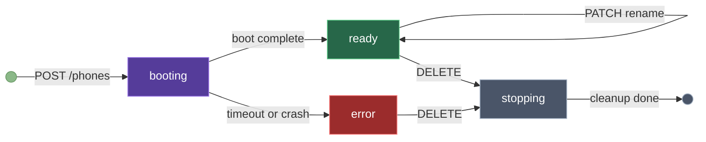
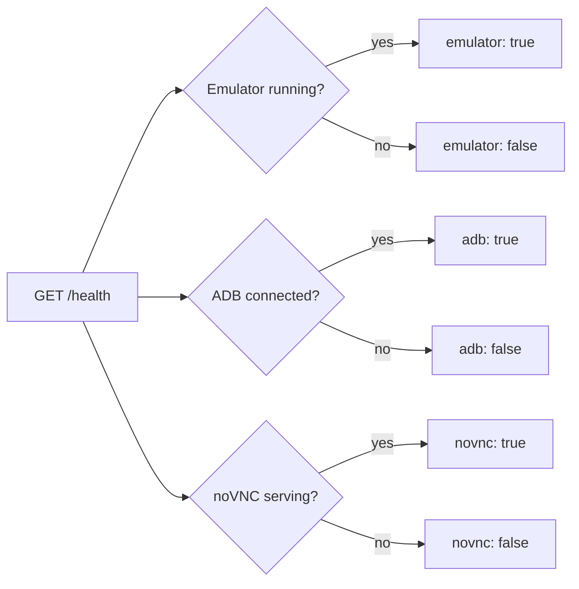

# Phones API

Manage virtual Android phones.

### Phone lifecycle



---

## Create Phone

```
POST /phones
```

Creates a new phone. Returns immediately with `status: "booting"`. Boot takes 15-30 seconds.

<!-- tabs:start -->

#### **Python**

```python
import requests, time

API = "http://localhost:3000/api/v1"
H = {"X-API-Key": "mas_your_key", "Content-Type": "application/json"}

phone = requests.post(f"{API}/phones", headers=H).json()

# Wait for boot
while requests.get(f"{API}/phones/{phone['id']}", headers=H).json()["status"] != "ready":
    time.sleep(3)
```

#### **JavaScript**

```javascript
const API = "http://localhost:3000/api/v1";
const H = { "X-API-Key": "mas_your_key", "Content-Type": "application/json" };

const phone = await fetch(`${API}/phones`, { method: "POST", headers: H }).then(r => r.json());

// Wait for boot
while (true) {
  const p = await fetch(`${API}/phones/${phone.id}`, { headers: H }).then(r => r.json());
  if (p.status === "ready") break;
  await new Promise(r => setTimeout(r, 3000));
}
```

#### **curl**

```bash
curl -X POST http://localhost:3000/api/v1/phones \
  -H "X-API-Key: mas_your_key"
```

<!-- tabs:end -->

**Response:**

```json
{
  "id": "phone-1",
  "name": "Phone 0",
  "novncPort": 6081,
  "status": "booting",
  "agentRunning": false
}
```

---

## List Phones

```
GET /phones
```

<!-- tabs:start -->

#### **Python**

```python
import requests

API = "http://localhost:3000/api/v1"
H = {"X-API-Key": "mas_your_key", "Content-Type": "application/json"}

phones = requests.get(f"{API}/phones", headers=H).json()
for p in phones:
    status = "Working" if p["agentRunning"] else p["status"]
    print(f"{p['id']}: {p['name']} — {status}")
```

#### **JavaScript**

```javascript
const API = "http://localhost:3000/api/v1";
const H = { "X-API-Key": "mas_your_key", "Content-Type": "application/json" };

const phones = await fetch(`${API}/phones`, { headers: H }).then(r => r.json());
phones.forEach(p => {
  const status = p.agentRunning ? "Working" : p.status;
  console.log(`${p.id}: ${p.name} — ${status}`);
});
```

#### **curl**

```bash
curl http://localhost:3000/api/v1/phones \
  -H "X-API-Key: mas_your_key"
```

<!-- tabs:end -->

**Response:**

```json
[
  { "id": "phone-1", "name": "My Phone", "novncPort": 6081, "status": "ready", "agentRunning": false }
]
```

| Field | Description |
|-------|-------------|
| `id` | Stable identifier |
| `name` | Display name (renameable) |
| `novncPort` | noVNC WebSocket port for live screen |
| `status` | `booting` · `ready` · `error` · `stopping` |
| `agentRunning` | `true` if AI agent is active |

---

## Get Phone

```
GET /phones/:id
```

Same response shape as list, for a single phone.

---

## Rename Phone

```
PATCH /phones/:id
```

<!-- tabs:start -->

#### **Python**

```python
import requests

API = "http://localhost:3000/api/v1"
H = {"X-API-Key": "mas_your_key", "Content-Type": "application/json"}

requests.patch(f"{API}/phones/phone-1", headers=H,
    json={"name": "Work Phone"})
```

#### **JavaScript**

```javascript
const API = "http://localhost:3000/api/v1";
const H = { "X-API-Key": "mas_your_key", "Content-Type": "application/json" };

await fetch(`${API}/phones/phone-1`, {
  method: "PATCH", headers: H,
  body: JSON.stringify({ name: "Work Phone" }),
});
```

#### **curl**

```bash
curl -X PATCH http://localhost:3000/api/v1/phones/phone-1 \
  -H "X-API-Key: mas_your_key" \
  -H "Content-Type: application/json" \
  -d '{"name": "Work Phone"}'
```

<!-- tabs:end -->

---

## Delete Phone

```
DELETE /phones/:id
```

Stops emulator, deletes AVD, removes all tasks, messages, and recordings.

<!-- tabs:start -->

#### **Python**

```python
import requests

API = "http://localhost:3000/api/v1"
H = {"X-API-Key": "mas_your_key", "Content-Type": "application/json"}

requests.delete(f"{API}/phones/phone-1", headers=H)
```

#### **JavaScript**

```javascript
const API = "http://localhost:3000/api/v1";
const H = { "X-API-Key": "mas_your_key", "Content-Type": "application/json" };

await fetch(`${API}/phones/phone-1`, { method: "DELETE", headers: H });
```

#### **curl**

```bash
curl -X DELETE http://localhost:3000/api/v1/phones/phone-1 \
  -H "X-API-Key: mas_your_key"
```

<!-- tabs:end -->

> [!WARNING]
> Irreversible. All data for this phone is permanently deleted.

---

## Health Check

```
GET /phones/:id/health
```

Checks all subsystems for a phone:



**Response:**

```json
{
  "healthy": true,
  "checks": { "emulator": true, "adb": true, "novnc": true }
}
```
