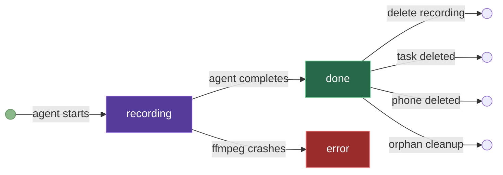
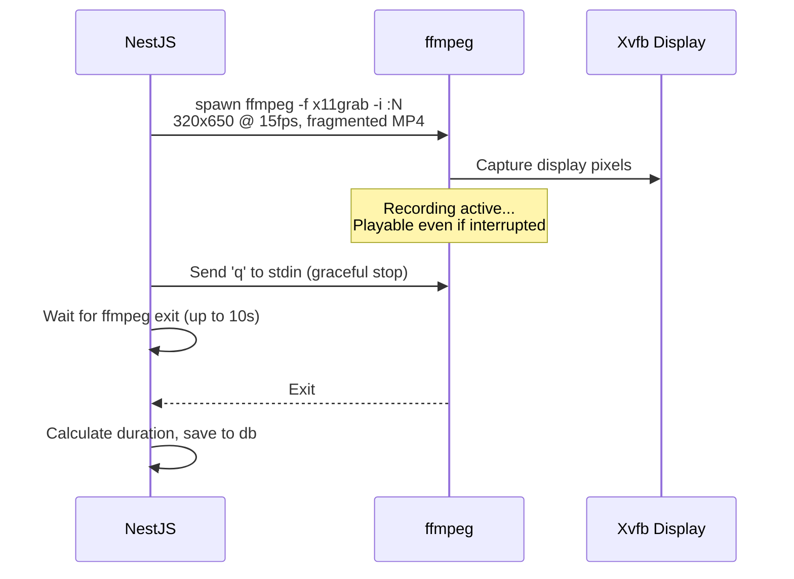

# Recordings API

Screen recordings are created automatically during every agent task.

### Recording lifecycle



### How recordings work



> [!NOTE]
> Recordings use **fragmented MP4** (`frag_keyframe+empty_moov`). This ensures videos are playable even if the agent task fails or the backend crashes mid-recording. Resolution is 320x650 at 15fps.

---

## List Recordings

```
GET /recordings
GET /recordings/phone/:phoneId
```

<!-- tabs:start -->

#### **Python**

```python
import requests

API = "http://localhost:3000/api/v1"
H = {"X-API-Key": "mas_your_key", "Content-Type": "application/json"}

recordings = requests.get(f"{API}/recordings", headers=H).json()
for r in recordings:
    print(f"{r['taskTitle']} on {r['phoneName']} — {r['durationSecs']}s")
```

#### **JavaScript**

```javascript
const API = "http://localhost:3000/api/v1";
const H = { "X-API-Key": "mas_your_key", "Content-Type": "application/json" };

const recordings = await fetch(`${API}/recordings`, { headers: H }).then(r => r.json());
recordings.forEach(r =>
  console.log(`${r.taskTitle} on ${r.phoneName} — ${r.durationSecs}s`)
);
```

#### **curl**

```bash
# All recordings
curl http://localhost:3000/api/v1/recordings \
  -H "X-API-Key: mas_your_key"

# Recordings for a phone
curl http://localhost:3000/api/v1/recordings/phone/phone-1 \
  -H "X-API-Key: mas_your_key"
```

<!-- tabs:end -->

**Response:**

```json
[
  {
    "id": "rec-123",
    "taskId": "task-456",
    "phoneId": "phone-1",
    "phoneName": "My Phone",
    "taskTitle": "Open Chrome",
    "filename": "rec-123.mp4",
    "durationSecs": 45,
    "status": "done",
    "createdAt": "2026-03-23T10:00:00.000Z"
  }
]
```

> [!NOTE]
> `phoneName` and `taskTitle` are resolved from current data, not snapshots. Renaming a phone updates all its recordings.

---

## Stream Video

```
GET /recordings/:id/video
```

Returns the MP4 file.

<!-- tabs:start -->

#### **Python**

```python
import requests

API = "http://localhost:3000/api/v1"
H = {"X-API-Key": "mas_your_key", "Content-Type": "application/json"}

resp = requests.get(f"{API}/recordings/rec-123/video", headers=H, stream=True)
with open("recording.mp4", "wb") as f:
    for chunk in resp.iter_content(8192):
        f.write(chunk)
```

#### **JavaScript**

```javascript
const API = "http://localhost:3000/api/v1";
const H = { "X-API-Key": "mas_your_key", "Content-Type": "application/json" };

const resp = await fetch(`${API}/recordings/rec-123/video`, { headers: H });
const blob = await resp.blob();
const url = URL.createObjectURL(blob);
// Use url in <video src={url}> or download
```

#### **curl**

```bash
curl http://localhost:3000/api/v1/recordings/rec-123/video \
  -H "X-API-Key: mas_your_key" -o recording.mp4
```

<!-- tabs:end -->

---

## Delete Recording

```
DELETE /recordings/:id
```

Deletes database entry and video file.

<!-- tabs:start -->

#### **Python**

```python
import requests

API = "http://localhost:3000/api/v1"
H = {"X-API-Key": "mas_your_key", "Content-Type": "application/json"}

requests.delete(f"{API}/recordings/rec-123", headers=H)
```

#### **JavaScript**

```javascript
const API = "http://localhost:3000/api/v1";
const H = { "X-API-Key": "mas_your_key", "Content-Type": "application/json" };

await fetch(`${API}/recordings/rec-123`, { method: "DELETE", headers: H });
```

#### **curl**

```bash
curl -X DELETE http://localhost:3000/api/v1/recordings/rec-123 \
  -H "X-API-Key: mas_your_key"
```

<!-- tabs:end -->

---

## Automatic cleanup

Recordings are deleted when:

- Their **task** is deleted
- Their **phone** is deleted
- **On startup** — orphaned recordings with no matching phone are cleaned up
- **On startup** — orphaned video files with no DB entry are removed
- **On startup** — recordings with status `recording` (interrupted by restart) are marked as `error`
