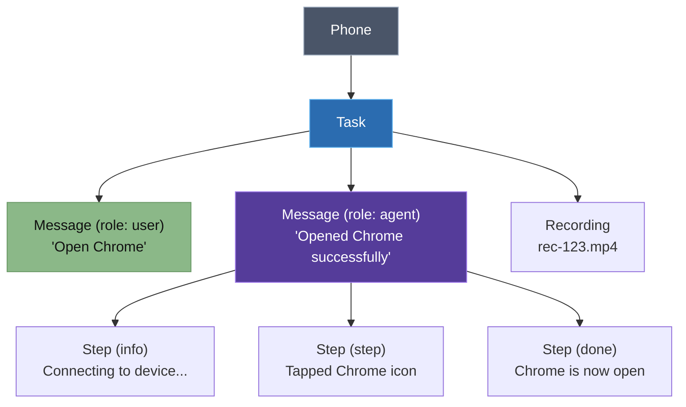

# Tasks API

Tasks are conversation sessions between you and the AI agent. Each task belongs to a phone and contains messages with chain-of-thought steps.

### Data structure



---

## List Tasks

```
GET /tasks
GET /tasks/phone/:phoneId
```

<!-- tabs:start -->

#### **Python**

```python
import requests

API = "http://localhost:3000/api/v1"
H = {"X-API-Key": "mas_your_key", "Content-Type": "application/json"}

# All tasks
tasks = requests.get(f"{API}/tasks", headers=H).json()

# Tasks for a specific phone
tasks = requests.get(f"{API}/tasks/phone/phone-1", headers=H).json()
for t in tasks:
    print(f"{t['id']}: {t['title']} ({len(t['messages'])} messages)")
```

#### **JavaScript**

```javascript
const API = "http://localhost:3000/api/v1";
const H = { "X-API-Key": "mas_your_key", "Content-Type": "application/json" };

// All tasks
const tasks = await fetch(`${API}/tasks`, { headers: H }).then(r => r.json());

// Tasks for a specific phone
const phoneTasks = await fetch(`${API}/tasks/phone/phone-1`, { headers: H }).then(r => r.json());
phoneTasks.forEach(t => console.log(`${t.id}: ${t.title} (${t.messages.length} messages)`));
```

#### **curl**

```bash
# All tasks
curl http://localhost:3000/api/v1/tasks \
  -H "X-API-Key: mas_your_key"

# Tasks for a phone
curl http://localhost:3000/api/v1/tasks/phone/phone-1 \
  -H "X-API-Key: mas_your_key"
```

<!-- tabs:end -->

---

## Get Task

```
GET /tasks/:id
```

Returns full task with message history and chain-of-thought steps.

<!-- tabs:start -->

#### **Python**

```python
import requests

API = "http://localhost:3000/api/v1"
H = {"X-API-Key": "mas_your_key", "Content-Type": "application/json"}

task = requests.get(f"{API}/tasks/task-123", headers=H).json()
for msg in task["messages"]:
    print(f"[{msg['role']}] {msg['content']}")
```

#### **JavaScript**

```javascript
const API = "http://localhost:3000/api/v1";
const H = { "X-API-Key": "mas_your_key", "Content-Type": "application/json" };

const task = await fetch(`${API}/tasks/task-123`, { headers: H }).then(r => r.json());
task.messages.forEach(m => console.log(`[${m.role}] ${m.content}`));
```

#### **curl**

```bash
curl http://localhost:3000/api/v1/tasks/task-123 \
  -H "X-API-Key: mas_your_key"
```

<!-- tabs:end -->

**Response:**

```json
{
  "id": "task-123",
  "phoneId": "phone-1",
  "title": "Check Android version",
  "pinned": false,
  "createdAt": "2026-03-23T10:00:00.000Z",
  "messages": [
    {
      "id": "msg-1",
      "role": "user",
      "content": "Check Android version",
      "timestamp": "2026-03-23T10:00:00.000Z"
    },
    {
      "id": "msg-2",
      "role": "agent",
      "content": "The Android version is 16.",
      "timestamp": "2026-03-23T10:00:01.000Z",
      "steps": [
        { "type": "info", "step": "Connecting to device...", "timestamp": "..." },
        { "type": "step", "step": "Opened Settings", "timestamp": "..." },
        { "type": "done", "step": "Android version is 16.", "timestamp": "..." }
      ]
    }
  ]
}
```

---

## Create Task

```
POST /tasks
```

<!-- tabs:start -->

#### **Python**

```python
import requests

API = "http://localhost:3000/api/v1"
H = {"X-API-Key": "mas_your_key", "Content-Type": "application/json"}

task = requests.post(f"{API}/tasks", headers=H,
    json={"phoneId": "phone-1", "title": "Install calculator"}).json()
```

#### **JavaScript**

```javascript
const API = "http://localhost:3000/api/v1";
const H = { "X-API-Key": "mas_your_key", "Content-Type": "application/json" };

const task = await fetch(`${API}/tasks`, {
  method: "POST", headers: H,
  body: JSON.stringify({ phoneId: "phone-1", title: "Install calculator" }),
}).then(r => r.json());
```

#### **curl**

```bash
curl -X POST http://localhost:3000/api/v1/tasks \
  -H "X-API-Key: mas_your_key" \
  -H "Content-Type: application/json" \
  -d '{"phoneId": "phone-1", "title": "Install calculator"}'
```

<!-- tabs:end -->

---

## Update Task

```
PATCH /tasks/:id
```

Rename or pin/unpin. Both fields optional.

<!-- tabs:start -->

#### **Python**

```python
import requests

API = "http://localhost:3000/api/v1"
H = {"X-API-Key": "mas_your_key", "Content-Type": "application/json"}

requests.patch(f"{API}/tasks/task-123", headers=H,
    json={"title": "New title", "pinned": True})
```

#### **JavaScript**

```javascript
const API = "http://localhost:3000/api/v1";
const H = { "X-API-Key": "mas_your_key", "Content-Type": "application/json" };

await fetch(`${API}/tasks/task-123`, {
  method: "PATCH", headers: H,
  body: JSON.stringify({ title: "New title", pinned: true }),
});
```

#### **curl**

```bash
curl -X PATCH http://localhost:3000/api/v1/tasks/task-123 \
  -H "X-API-Key: mas_your_key" \
  -H "Content-Type: application/json" \
  -d '{"title": "New title", "pinned": true}'
```

<!-- tabs:end -->

---

## Delete Task

```
DELETE /tasks/:id
```

Deletes task, all messages, and associated recordings.

<!-- tabs:start -->

#### **Python**

```python
import requests

API = "http://localhost:3000/api/v1"
H = {"X-API-Key": "mas_your_key", "Content-Type": "application/json"}

requests.delete(f"{API}/tasks/task-123", headers=H)
```

#### **JavaScript**

```javascript
const API = "http://localhost:3000/api/v1";
const H = { "X-API-Key": "mas_your_key", "Content-Type": "application/json" };

await fetch(`${API}/tasks/task-123`, { method: "DELETE", headers: H });
```

#### **curl**

```bash
curl -X DELETE http://localhost:3000/api/v1/tasks/task-123 \
  -H "X-API-Key: mas_your_key"
```

<!-- tabs:end -->

---

## Add Message

```
POST /tasks/:id/messages
```

```json
{ "id": "msg-1", "role": "user", "content": "Open Chrome", "timestamp": "2026-03-23T10:00:00Z" }
```

## Update Message

```
PATCH /tasks/:taskId/messages/:msgId
```

## Append Steps

```
POST /tasks/:taskId/messages/:msgId/steps
```

```json
{
  "steps": [
    { "type": "step", "step": "Opened Chrome", "timestamp": "2026-03-23T10:00:05Z" },
    { "type": "done", "step": "Search complete", "timestamp": "2026-03-23T10:00:10Z" }
  ]
}
```

Step types: `info` · `step` · `done` · `error`
