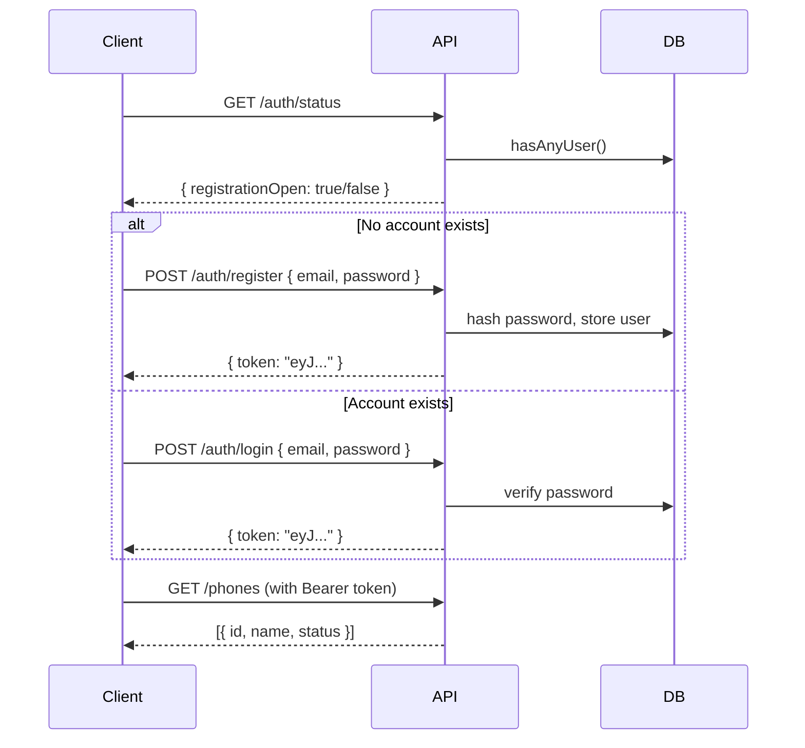
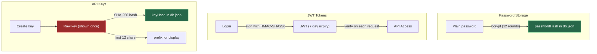

# Authentication Overview

Mobile Agent Studio uses two authentication methods:

| Method | Use Case | Lifetime | Header |
|--------|----------|----------|--------|
| **JWT Token** | Browser sessions, interactive use | 7 days | `Authorization: Bearer <token>` |
| **API Key** | Scripts, CI/CD, external integrations | Permanent (until deleted) | `X-API-Key: mas_...` |

## How it works

1. **First visit** — no account exists. The registration form appears.
2. **Register** — create email + password. Registration closes permanently after the first account.
3. **Login** — returns a JWT token valid for 7 days.
4. **API Keys** — created from the dashboard (key icon in top-right). The raw key is shown once and never stored — only its SHA-256 hash is persisted.

## Auth flow

## Public endpoints

These endpoints do **not** require authentication:

| Endpoint | Purpose |
|----------|---------|
| `GET /api/v1/auth/status` | Check if registration is open |
| `POST /api/v1/auth/register` | Create first account |
| `POST /api/v1/auth/login` | Login |

All other endpoints require either a JWT token or an API key.

## Security details

- Passwords are hashed with **bcrypt** (12 rounds)
- JWT tokens are signed with HMAC-SHA256
- API keys are stored as **SHA-256 hashes** — the raw key exists only in the creation response
- API key prefix (`mas_a1b2c3d4...`) is stored for display purposes
- Registration is permanently closed after the first user — no multi-user support
