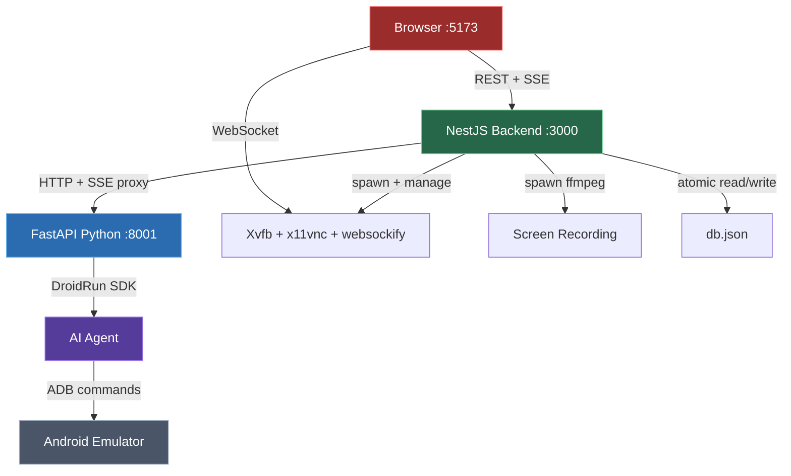
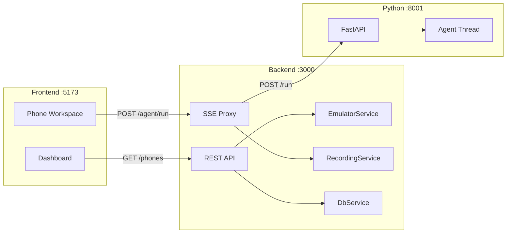
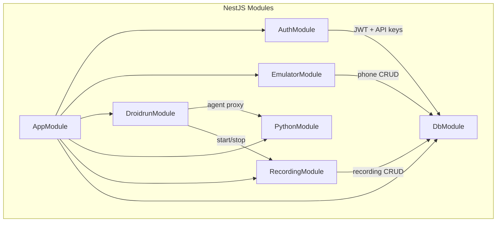
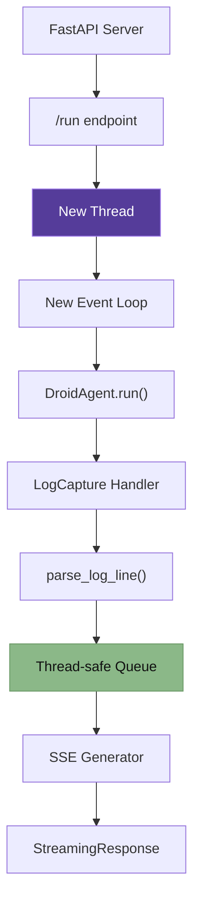
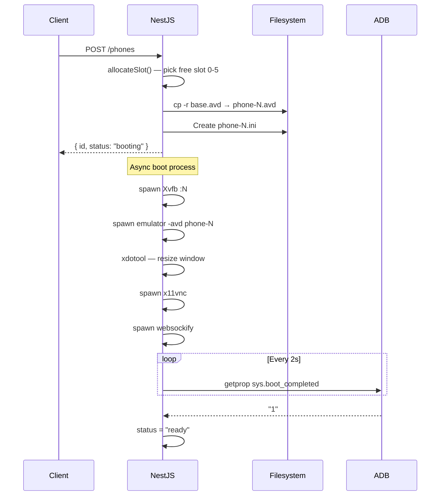
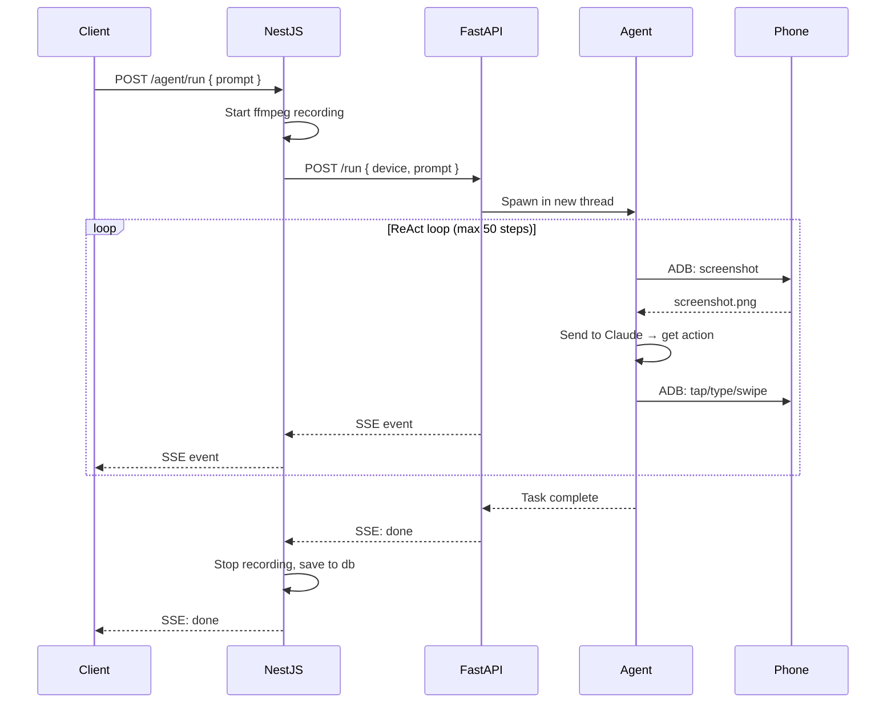
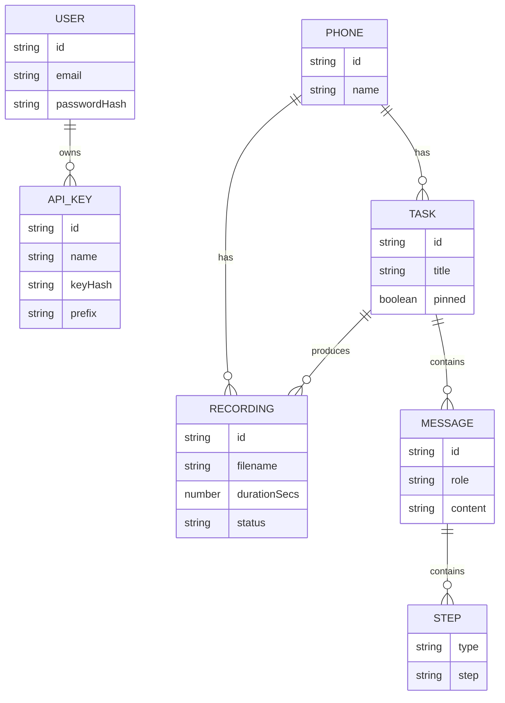
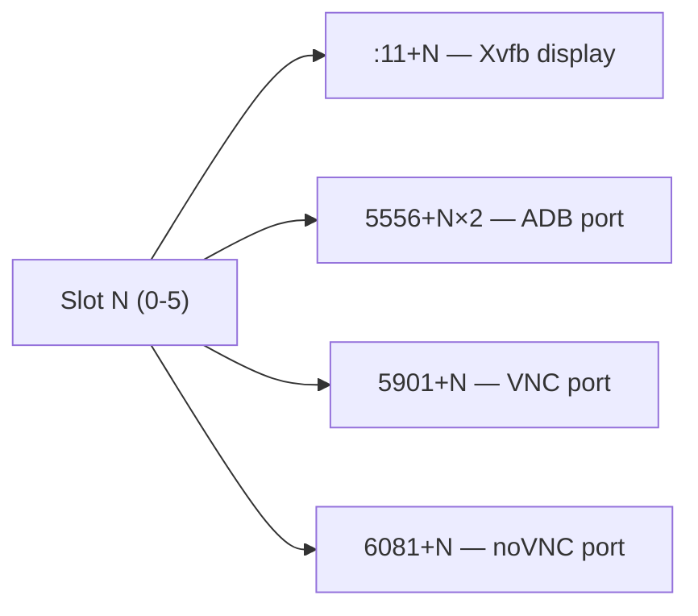
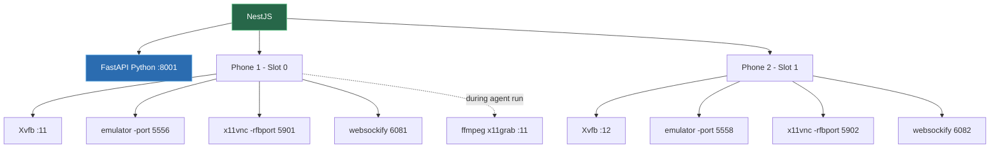

# Architecture

## System Overview

### Request flow

---

## Components

### NestJS Backend (`:3000`)

The main API server, organized into modules:

| Module | Responsibility |
|--------|---------------|
| **AuthModule** | JWT tokens, API keys, bcrypt hashing, global guard |
| **EmulatorModule** | Phone lifecycle — AVD cloning, 4 child processes, port allocation |
| **DroidrunModule** | SSE proxy to FastAPI, event buffering, reconnection |
| **PythonModule** | Spawns + monitors FastAPI process, health checks |
| **RecordingModule** | ffmpeg screen capture, video serving, orphan cleanup |
| **DbModule** | In-memory state + atomic file persistence |

### FastAPI Python Service (`:8001`)

Spawned by NestJS on startup. Wraps the DroidRun SDK:

Key design: the agent runs in a **separate thread** with its own `asyncio` event loop. This avoids blocking FastAPI's ASGI loop. Communication happens via a thread-safe `queue.Queue`.

### Frontend (`:5173`)

React + Vite + Tailwind + shadcn/ui:

- **Dashboard** — phone grid with live noVNC previews, playback gallery
- **Phone workspace** — 3-column layout (phone screen | task list | chat)
- **Auth** — login/register, API key management

### Docsify Docs (`:3001`)

This documentation site — static HTML served via Python's built-in HTTP server.

---

## Data Flow

### Creating a phone

### Running an agent task

### Persistence

All state lives in `data/db.json`. The `DbService` holds everything in memory and atomically writes to disk on every mutation:

### Data model

---

## Port Allocation

Each phone gets a unique set of ports based on its slot index (0-5):

| Resource | Formula | Slot 0 | Slot 1 | Slot 2 |
|----------|---------|--------|--------|--------|
| Xvfb display | `:11 + slot` | `:11` | `:12` | `:13` |
| ADB port | `5556 + slot × 2` | `5556` | `5558` | `5560` |
| VNC port | `5901 + slot` | `5901` | `5902` | `5903` |
| noVNC port | `6081 + slot` | `6081` | `6082` | `6083` |

Maximum 6 concurrent phones. Slots are reused when phones are deleted.

---

## Process Tree

Each phone spawns 4 managed child processes, each with a supervisor that auto-restarts up to 3 times:

