# How It Works

A deep dive into what happens under the hood when you create phones, run tasks, and stream results.

---

## The Display Pipeline

Each virtual phone needs to render its Android screen to a browser. This requires a chain of four processes:

### Why four processes?

| Process | Role | Why it's needed |
|---------|------|----------------|
| **Xvfb** | Virtual framebuffer | The emulator needs an X11 display to render to, but there's no physical monitor. Xvfb creates a fake display in memory. |
| **Android Emulator** | Runs Android | Renders the phone's GUI to the Xvfb display. Runs headless with `-no-audio -no-boot-anim`. |
| **x11vnc** | Screen capture | Reads pixels from the Xvfb display and serves them over the VNC protocol. |
| **websockify** | Protocol bridge | Bridges VNC (TCP) to WebSocket so the browser can connect. Also serves the noVNC HTML client. |

### Port allocation per phone

Each phone gets a unique slot (0-5) that determines all its ports:

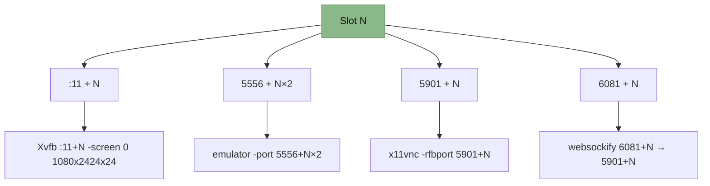

> [!NOTE]
> Maximum 6 concurrent phones. When a phone is deleted, its slot is freed and reused by the next phone created.

---

## Phone Boot Sequence

When you call `POST /phones`, here's the full sequence:

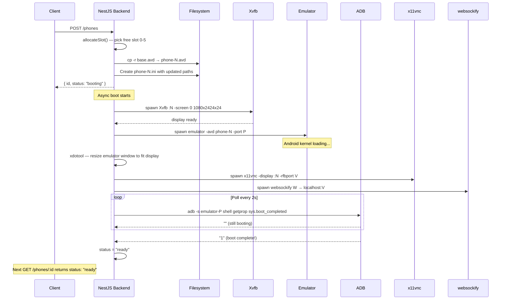

### Phone states

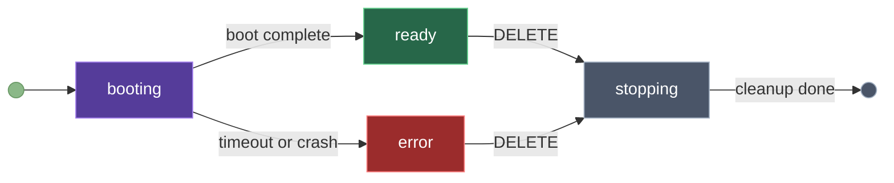

---

## The AI Agent Pipeline

When you send a prompt, it flows through three services before reaching the phone:

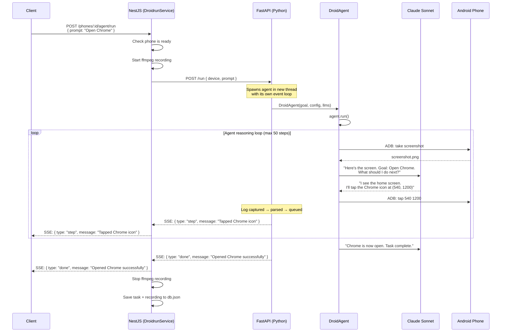

### How the agent "sees" and "acts"

The DroidRun agent operates in a **ReAct loop** (Reason → Act → Observe):

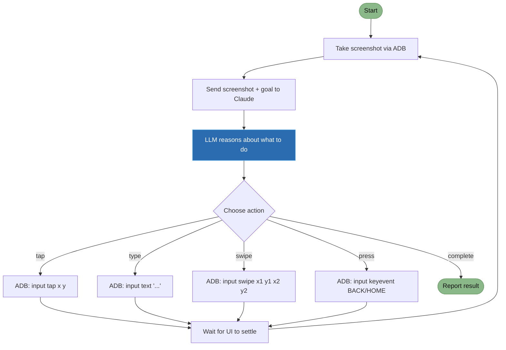

The agent's configuration:

| Setting | Value | Why |
|---------|-------|-----|
| `max_steps` | 50 | Prevent infinite loops |
| `vision` | true | Agent can see screenshots |
| `after_sleep_action` | 4.0s | Wait for animations to finish |
| `wait_for_stable_ui` | 2.0s | Wait for UI to stop changing |

---

## SSE Streaming Architecture

The streaming system has three layers, with reconnection support:

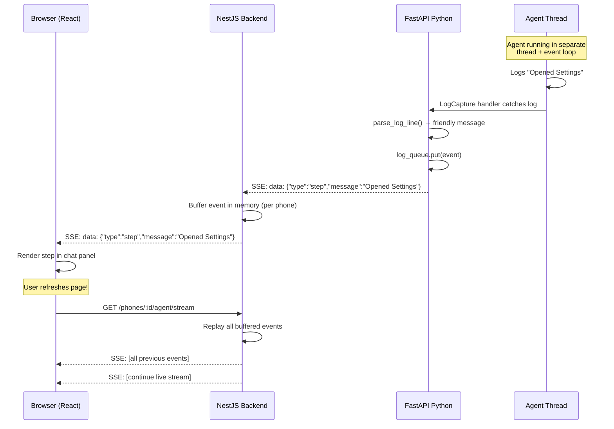

### Event buffering

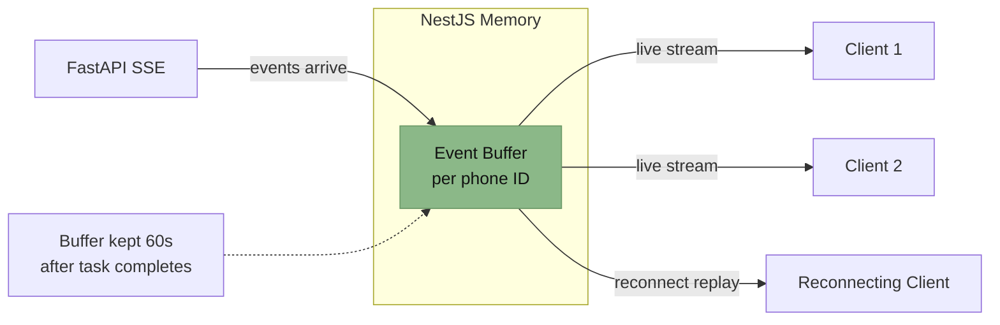

---

## Screen Recording

Every agent task is automatically recorded using ffmpeg:

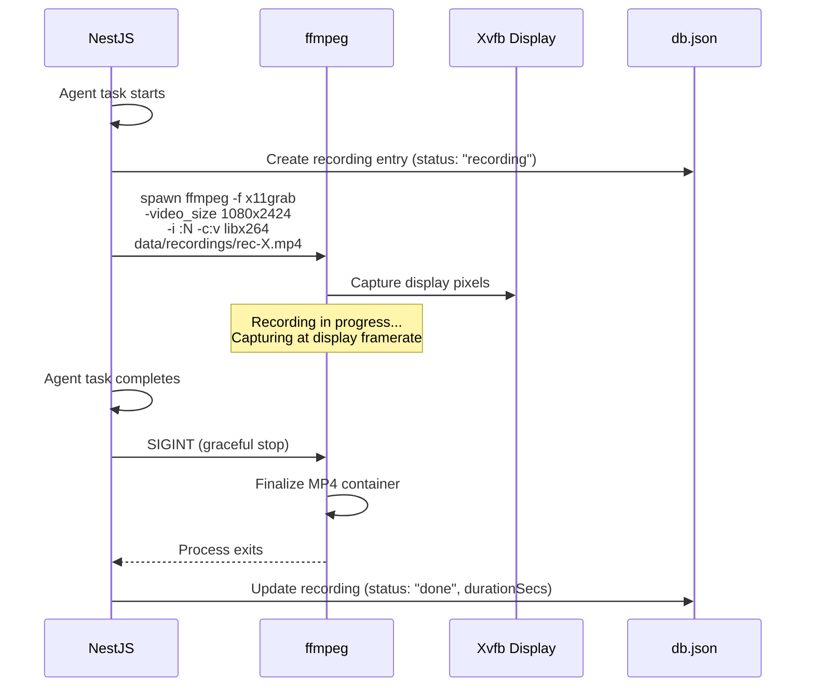

### Recording lifecycle

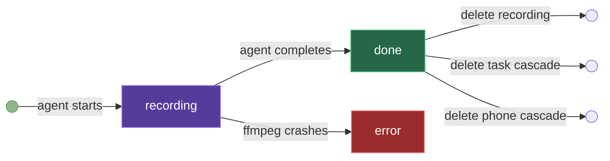

---

## Data Persistence

All state lives in a single `data/db.json` file. The DbService holds everything in memory and writes atomically on every mutation:

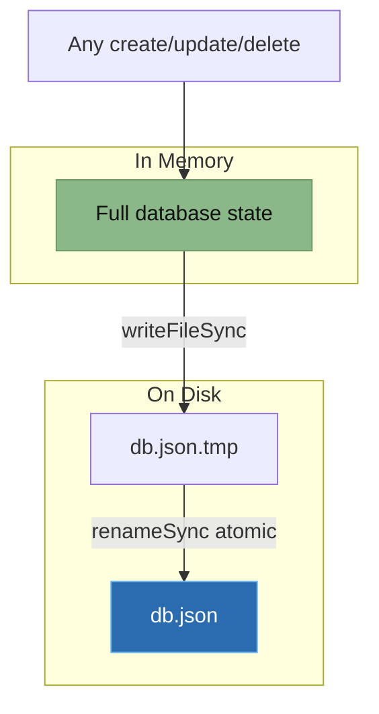

### Why atomic writes?

If the process crashes mid-write, `db.json` could be corrupted (partially written). The `writeFileSync → renameSync` pattern ensures:

1. Data is fully written to `db.json.tmp` first
2. `renameSync` is an **atomic** operation on Linux — it either fully replaces the file or doesn't
3. If a crash happens during step 1, only the `.tmp` file is corrupted — `db.json` remains intact

### Data model

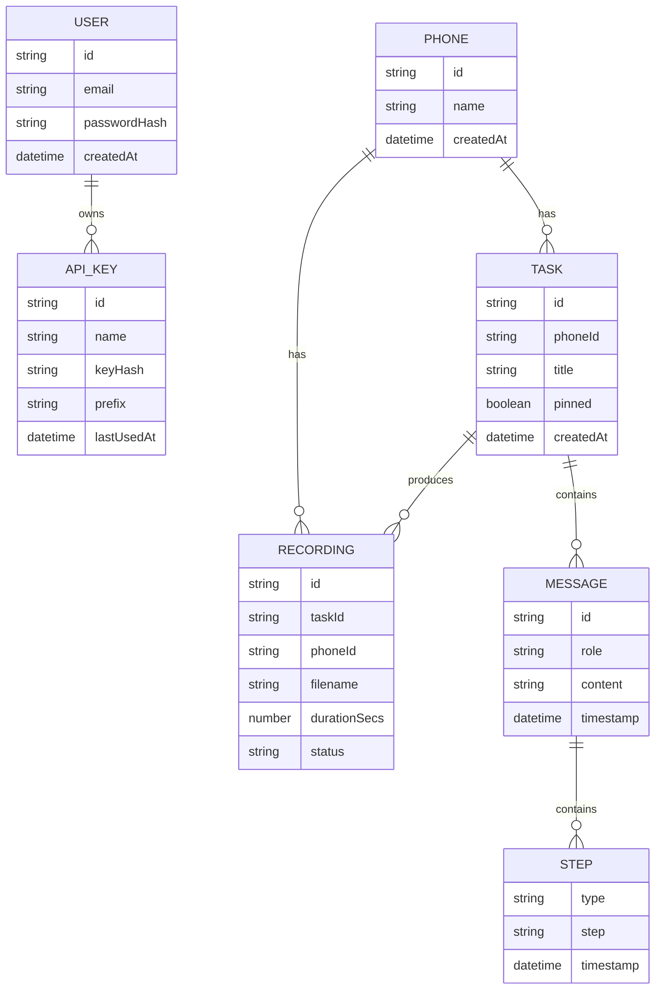

---

## Process Supervision

Each child process (Xvfb, emulator, x11vnc, websockify) is wrapped in a supervisor:

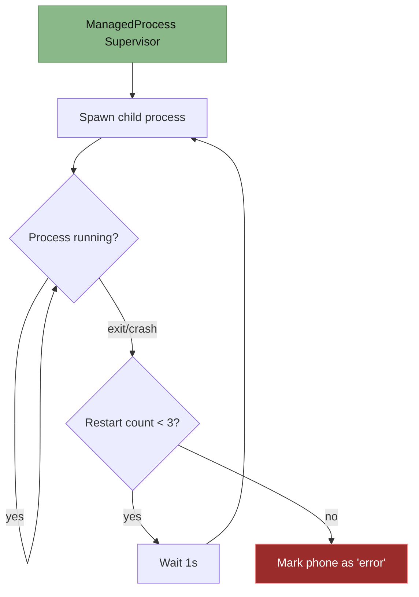

### Cleanup on shutdown

When the backend stops (Ctrl+C or crash), `onApplicationShutdown()` runs:

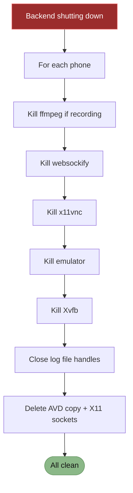

---

## Startup Sequence

When you run `./start.sh`, the backend performs several initialization steps:

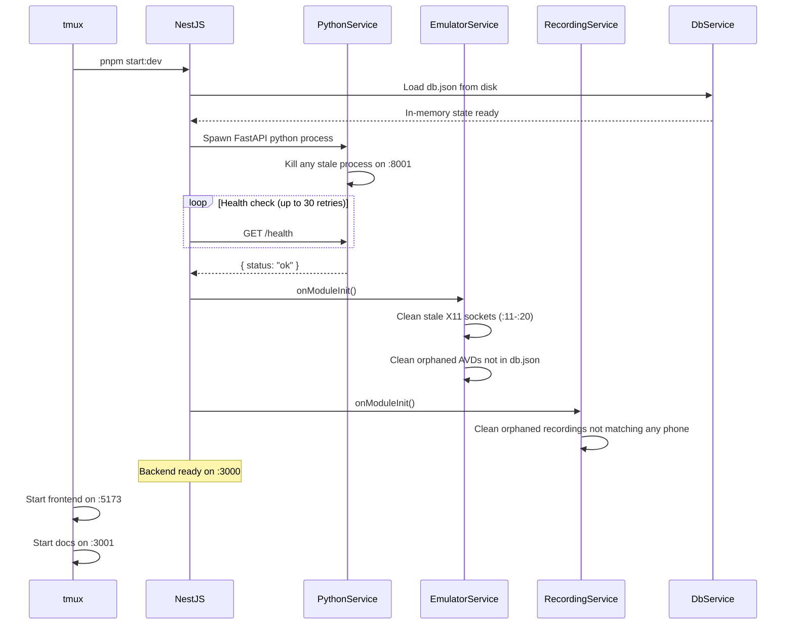
