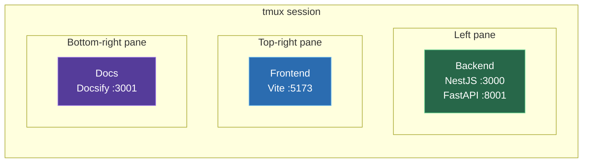

# Installation

## Prerequisites

| Requirement | Version |
|-------------|---------|
| Node.js | 18+ |
| pnpm | 9+ |
| Python | 3.11-3.13 |
| Android SDK | With emulator |
| ffmpeg | Any recent version |
| tmux | Any recent version |

### System Packages

<!-- tabs:start -->

#### **Fedora**

```bash
sudo dnf install -y xorg-x11-server-Xvfb x11vnc novnc python3-websockify xdotool ffmpeg tmux
```

#### **Ubuntu / Debian**

```bash
sudo apt install -y xvfb x11vnc novnc websockify xdotool ffmpeg tmux
```

#### **macOS**

```bash
brew install ffmpeg xdotool tmux
# Xvfb and x11vnc are Linux-only — macOS requires alternative display capture
```

<!-- tabs:end -->

## Setup

### 1. Clone the repository

```bash
git clone https://github.com/mhd12e/MAS.git agent-mobiles
cd agent-mobiles
```

### 2. Install backend dependencies

```bash
cd backend
pnpm install
```

### 3. Set up the Python agent environment

```bash
cd python
python3.13 -m venv .venv
.venv/bin/pip install -r requirements.txt
cd ../..
```

### 4. Install frontend dependencies

```bash
cd frontend
pnpm install
cd ..
```

### 5. Configure environment

```bash
cp backend/.env.example backend/.env
```

Edit `backend/.env`:

```env
ANTHROPIC_API_KEY=sk-ant-api03-your-key-here
ANDROID_SDK_ROOT=/home/you/Android/Sdk
ANDROID_AVD_HOME=/home/you/.android/avd
BASE_AVD_NAME=Pixel_9_Pro_XL
```

> [!NOTE]
> The `BASE_AVD_NAME` must match an existing AVD created in Android Studio. This AVD is cloned for each virtual phone.

### 6. Create a base AVD

Open Android Studio → Device Manager → Create Device. Choose any phone profile and a recent system image. Name it exactly as set in `BASE_AVD_NAME`.

### 7. Start

```bash
./start.sh
```

This launches everything in a single tmux session with three panes:



| Pane | Service | URL |
|------|---------|-----|
| Left | Backend (NestJS + FastAPI) | `http://localhost:3000` |
| Top-right | Frontend (Vite) | `http://localhost:5173` |
| Bottom-right | Docs (Docsify) | `http://localhost:3001` |

> [!TIP]
> Switch between tmux panes with `Ctrl+B` then arrow keys. Zoom a pane with `Ctrl+B` then `Z`. Closing any pane kills the entire session and cleans up all ports.

### What `start.sh` does

1. Kills any leftover processes on ports 3000, 3001, 5173, 8001
2. Creates a tmux session with labeled panes
3. Starts the backend (`pnpm start:dev`), frontend (`pnpm dev`), and docs (`python3 -m http.server 3001`)
4. Sets up a cleanup hook — closing any pane kills everything

> [!NOTE]
> You don't need to start services manually. `./start.sh` handles everything. Just make sure tmux is installed.
