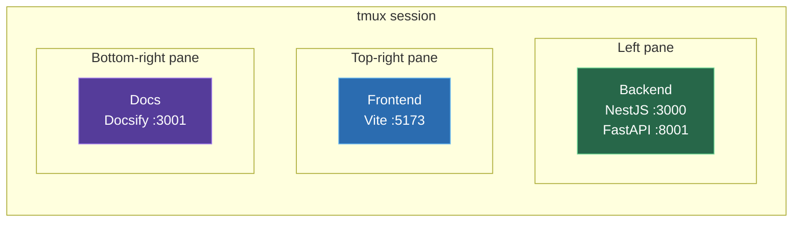

# Installation

## Prerequisites

| Requirement | Version | What it's for |
|-------------|---------|---------------|
| Android Studio | Latest | Provides SDK, emulator, and AVD manager |
| Node.js | 18+ | Runs the NestJS backend |
| pnpm | 9+ | Package manager for Node.js |
| Python | 3.11-3.13 | Runs the DroidRun agent service |
| ffmpeg | Any recent | Screen recording during agent tasks |
| tmux | Any recent | Multi-pane dev environment via `start.sh` |

---

### Install Android Studio + SDK

Download from [developer.android.com/studio](https://developer.android.com/studio).

During installation, make sure to include:
- Android SDK
- Android Emulator
- Android SDK Platform-Tools

After installation, verify:

```bash
# Check SDK exists (default location)
ls ~/Android/Sdk/emulator/emulator

# Check ADB is available
adb --version
```

> [!NOTE]
> The SDK is typically installed at `~/Android/Sdk` on Linux and `~/Library/Android/sdk` on macOS. If `adb` isn't in your PATH, add `~/Android/Sdk/platform-tools` to your PATH in `~/.bashrc` or `~/.zshrc`.

### Create a Base AVD

Open Android Studio → **Device Manager** → **Create Virtual Device**:

1. Pick a phone profile (e.g. **Pixel 9 Pro XL**)
2. Download and select a system image (e.g. **API 35**, **VanillaIceCream**)
3. Name it `Pixel_9_Pro_XL` (this must match `BASE_AVD_NAME` in `.env`)
4. Click **Finish** — you don't need to start it

Your AVD files will be created at:

| OS | Path |
|----|------|
| Linux (standard) | `~/.android/avd/` |
| Linux (Android Studio Flatpak) | `~/.var/app/com.google.AndroidStudio/config/.android/avd/` |
| macOS | `~/.android/avd/` |

Verify:

```bash
ls ~/.android/avd/
# Should show: Pixel_9_Pro_XL.avd/  Pixel_9_Pro_XL.ini
```

### Install Node.js + pnpm

```bash
# Install Node.js via nvm (recommended)
curl -o- https://raw.githubusercontent.com/nvm-sh/nvm/v0.40.3/install.sh | bash
source ~/.bashrc   # or ~/.zshrc
nvm install --lts

# Enable pnpm via corepack
corepack enable pnpm
```

Verify:

```bash
node --version   # v18+ or v20+
pnpm --version   # 9+
```

### Install Python

<!-- tabs:start -->

#### **Fedora**

```bash
sudo dnf install -y python3.13 python3.13-venv
```

#### **Ubuntu / Debian**

```bash
sudo apt install -y python3 python3-venv
```

#### **macOS**

```bash
brew install python@3.13
```

<!-- tabs:end -->

Verify:

```bash
python3 --version   # 3.11-3.13
```

### Install System Packages

<!-- tabs:start -->

#### **Fedora**

```bash
sudo dnf install -y xorg-x11-server-Xvfb x11vnc novnc python3-websockify xdotool ffmpeg tmux
```

#### **Ubuntu / Debian**

```bash
sudo apt install -y xvfb x11vnc novnc websockify xdotool ffmpeg tmux
```

#### **macOS**

```bash
brew install ffmpeg xdotool tmux
# Xvfb and x11vnc are Linux-only — macOS requires alternative display capture
```

<!-- tabs:end -->

### Get an Anthropic API Key

Sign up at [console.anthropic.com](https://console.anthropic.com/) and create an API key. The agent uses **Claude Sonnet** for reasoning and vision.

---

## Setup

### 1. Clone the repository

```bash
git clone https://github.com/mhd12e/MAS.git agent-mobiles
cd agent-mobiles
```

### 2. Install backend dependencies

```bash
cd backend
pnpm install
```

### 3. Set up the Python agent environment

```bash
cd python
python3.13 -m venv .venv
.venv/bin/pip install -r requirements.txt
cd ../..
```

### 4. Install frontend dependencies

```bash
cd frontend
pnpm install
cd ..
```

### 5. Configure environment

```bash
cp backend/.env.example backend/.env
```

Edit `backend/.env`:

```env
# Required — your Anthropic API key from https://console.anthropic.com/
ANTHROPIC_API_KEY=sk-ant-api03-your-key-here

# Path to Android SDK
# Find with: echo $ANDROID_HOME  or  echo $ANDROID_SDK_ROOT
ANDROID_SDK_ROOT=/home/you/Android/Sdk

# Path to AVD directory (where .avd folders live)
# Find with: ls ~/.android/avd/
ANDROID_AVD_HOME=/home/you/.android/avd

# Name of the base AVD to clone for each phone
# Must match the folder name without .avd extension
BASE_AVD_NAME=Pixel_9_Pro_XL
```

**How to find your paths:**

| Variable | How to find it |
|----------|---------------|
| `ANDROID_SDK_ROOT` | `echo $ANDROID_HOME` or `echo $ANDROID_SDK_ROOT`, or check `~/Android/Sdk` |
| `ANDROID_AVD_HOME` | `ls ~/.android/avd/` — you should see `YourAVD.avd/` and `YourAVD.ini` |
| `BASE_AVD_NAME` | The folder name without `.avd` — e.g. `Pixel_9_Pro_XL.avd/` → `Pixel_9_Pro_XL` |

> [!WARNING]
> **Flatpak Android Studio?** Your AVD path is likely `~/.var/app/com.google.AndroidStudio/config/.android/avd/` — not the standard `~/.android/avd/`.

### 6. Start

```bash
./start.sh
```

This launches everything in a single tmux session with three panes:



| Pane | Service | URL |
|------|---------|-----|
| Left | Backend (NestJS + FastAPI) | `http://localhost:3000` |
| Top-right | Frontend (Vite) | `http://localhost:5173` |
| Bottom-right | Docs (Docsify) | `http://localhost:3001` |

> [!TIP]
> Switch between tmux panes with `Ctrl+B` then arrow keys. Zoom a pane with `Ctrl+B` then `Z`. Closing any pane kills the entire session and cleans up all ports.

### What `start.sh` does

1. Kills any leftover processes on ports 3000, 3001, 5173, 8001
2. Creates a tmux session with labeled panes
3. Starts the backend (`pnpm start:dev`), frontend (`pnpm dev`), and docs (`python3 -m http.server 3001`)
4. Sets up a cleanup hook — closing any pane kills everything

> [!NOTE]
> You don't need to start services manually. `./start.sh` handles everything. Just make sure tmux is installed.
