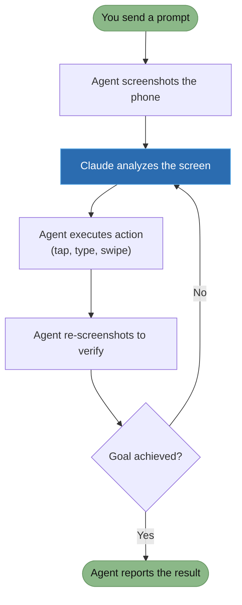

# Quick Start

Create your first phone and run an AI task.

---

## Using the Dashboard

1. Open `http://localhost:5173`
2. Register your account (first visit only)
3. Click **New Phone** — wait 15-30 seconds for boot
4. Click the phone card to open the workspace
5. Type an instruction: `Open Chrome and search for "hello world"`
6. Watch the AI work in real-time

---

## Using the API

### 1. Get an API key

Dashboard → key icon (top-right) → create a key → copy it.

### 2. Run a task

<!-- tabs:start -->

#### **Python (sync)**

```python
import requests, time

API = "http://localhost:3000/api/v1"
H = {"X-API-Key": "mas_your_key", "Content-Type": "application/json"}

# Create phone and wait for boot
phone = requests.post(f"{API}/phones", headers=H).json()
while requests.get(f"{API}/phones/{phone['id']}", headers=H).json()["status"] != "ready":
    time.sleep(3)

# Run task — blocks until the agent finishes
result = requests.post(
    f"{API}/phones/{phone['id']}/agent/run-sync",
    headers=H,
    json={"prompt": "Open Chrome and search for hello world"},
).json()

print(result["result"])

# Cleanup
requests.delete(f"{API}/phones/{phone['id']}", headers=H)
```

#### **Python (streaming)**

```python
import requests, json, time

API = "http://localhost:3000/api/v1"
H = {"X-API-Key": "mas_your_key", "Content-Type": "application/json"}

# Create phone and wait for boot
phone = requests.post(f"{API}/phones", headers=H).json()
while requests.get(f"{API}/phones/{phone['id']}", headers=H).json()["status"] != "ready":
    time.sleep(3)

# Run task — see each step in real-time
resp = requests.post(
    f"{API}/phones/{phone['id']}/agent/run",
    headers=H,
    json={"prompt": "Open Chrome and search for hello world"},
    stream=True,
)

for line in resp.iter_lines():
    line = line.decode()
    if line.startswith("data: "):
        event = json.loads(line[6:])
        print(f"[{event['type']}] {event['message']}")

# Cleanup
requests.delete(f"{API}/phones/{phone['id']}", headers=H)
```

#### **JavaScript (sync)**

```javascript
const API = "http://localhost:3000/api/v1";
const H = { "X-API-Key": "mas_your_key", "Content-Type": "application/json" };

// Create phone and wait for boot
const phone = await fetch(`${API}/phones`, { method: "POST", headers: H }).then(r => r.json());
while (true) {
  const p = await fetch(`${API}/phones/${phone.id}`, { headers: H }).then(r => r.json());
  if (p.status === "ready") break;
  await new Promise(r => setTimeout(r, 3000));
}

// Run task — blocks until done
const result = await fetch(`${API}/phones/${phone.id}/agent/run-sync`, {
  method: "POST", headers: H,
  body: JSON.stringify({ prompt: "Open Chrome and search for hello world" }),
}).then(r => r.json());

console.log(result.result);

// Cleanup
await fetch(`${API}/phones/${phone.id}`, { method: "DELETE", headers: H });
```

#### **JavaScript (streaming)**

```javascript
const API = "http://localhost:3000/api/v1";
const H = { "X-API-Key": "mas_your_key", "Content-Type": "application/json" };

// Create phone and wait for boot
const phone = await fetch(`${API}/phones`, { method: "POST", headers: H }).then(r => r.json());
while (true) {
  const p = await fetch(`${API}/phones/${phone.id}`, { headers: H }).then(r => r.json());
  if (p.status === "ready") break;
  await new Promise(r => setTimeout(r, 3000));
}

// Run task — see each step live
const resp = await fetch(`${API}/phones/${phone.id}/agent/run`, {
  method: "POST", headers: H,
  body: JSON.stringify({ prompt: "Open Chrome and search for hello world" }),
});

const reader = resp.body.getReader();
const decoder = new TextDecoder();
let buffer = "";

while (true) {
  const { done, value } = await reader.read();
  if (done) break;
  buffer += decoder.decode(value, { stream: true });
  const lines = buffer.split("\n");
  buffer = lines.pop();
  for (const line of lines) {
    if (!line.startsWith("data: ")) continue;
    const event = JSON.parse(line.slice(6));
    console.log(`[${event.type}] ${event.message}`);
  }
}

// Cleanup
await fetch(`${API}/phones/${phone.id}`, { method: "DELETE", headers: H });
```

#### **curl**

```bash
# Uses API key header throughout

# Create phone and wait for boot
PHONE=$(curl -s -X POST http://localhost:3000/api/v1/phones \
  -H "X-API-Key: mas_your_key" | jq -r .id)

while [ "$(curl -s http://localhost:3000/api/v1/phones/$PHONE \
  -H "X-API-Key: mas_your_key" | jq -r .status)" != "ready" ]; do
  sleep 3
done

# Run task (sync)
curl -X POST http://localhost:3000/api/v1/phones/$PHONE/agent/run-sync \
  -H "X-API-Key: mas_your_key" \
  -H "Content-Type: application/json" \
  -d '{"prompt": "Open Chrome and search for hello world"}'

# Cleanup
curl -X DELETE http://localhost:3000/api/v1/phones/$PHONE \
  -H "X-API-Key: mas_your_key"
```

<!-- tabs:end -->

---

## What happens during a task



1. The agent reads the phone screen
2. Plans which actions to take
3. Executes step by step (tap, type, swipe, wait)
4. Verifies each action by re-reading the screen
5. Reports the final result

The phone screen is automatically recorded during each task. Playbacks appear in the dashboard after completion.
