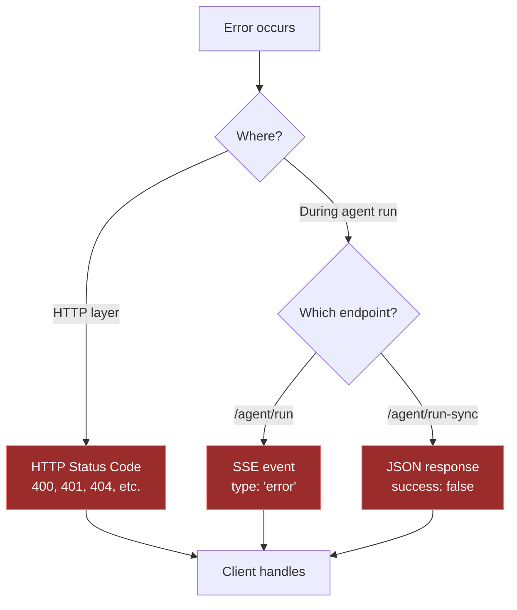
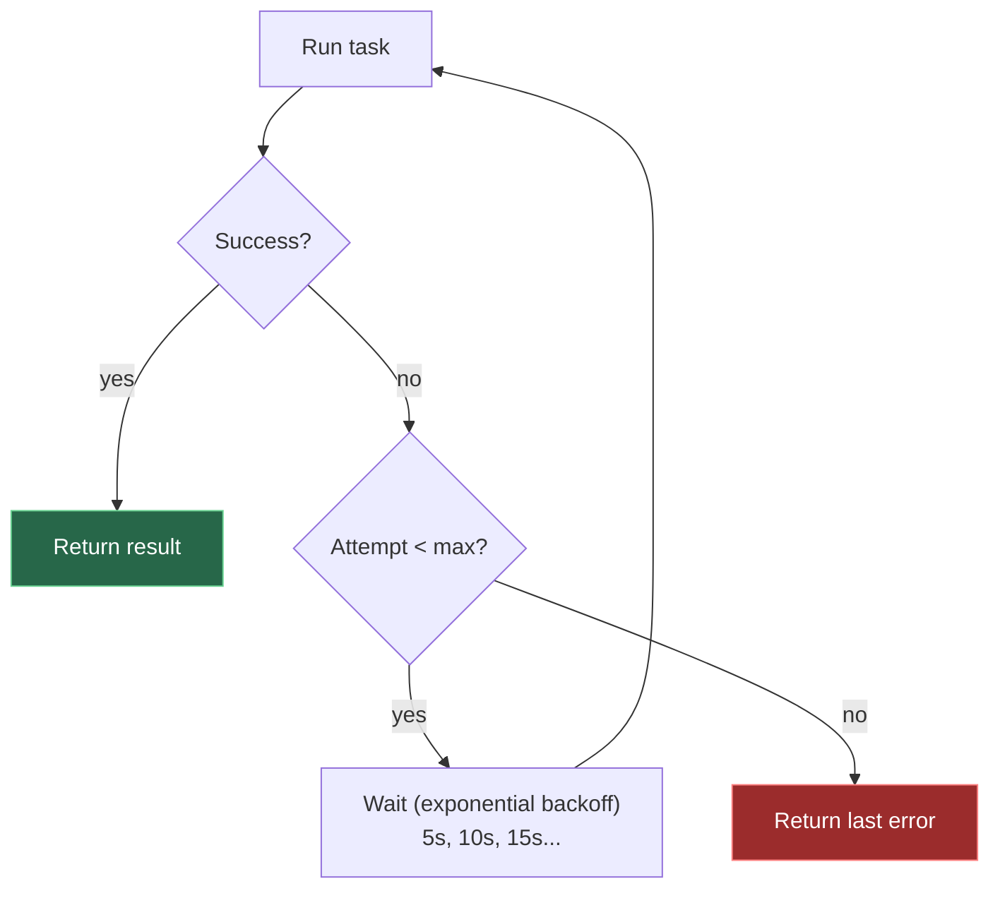

# Error Handling

### Error flow through the system



## HTTP Status Codes

| Code | Meaning | Action |
|------|---------|--------|
| `200` | Success | — |
| `201` | Created | Resource created |
| `400` | Bad Request | Check request body |
| `401` | Unauthorized | Invalid or missing token/API key |
| `403` | Forbidden | Registration closed |
| `404` | Not Found | Resource doesn't exist |
| `503` | Service Unavailable | Phone creation failed |

---

## Agent Errors

Errors during agent execution appear differently depending on the endpoint:

**Streaming (`/agent/run`)** — SSE event with `type: "error"`:

```
data: {"type": "error", "message": "Could not connect to the phone."}
```

**Synchronous (`/agent/run-sync`)** — JSON with `success: false`:

```json
{ "success": false, "result": null, "steps": [], "stepCount": 0, "error": "Could not connect to the phone." }
```

### Common agent errors

| Error | Cause | Fix |
|-------|-------|-----|
| Could not connect to the phone | Phone not booted | Wait for `status: "ready"` |
| AI service authentication failed | Invalid Anthropic API key | Check `ANTHROPIC_API_KEY` in `.env` |
| AI rate limit reached | Too many API calls | Wait and retry |
| The task timed out | Exceeded 50 steps | Simplify the instruction |

---

## Handling errors in code

<!-- tabs:start -->

#### **Python (sync)**

```python
import requests, time

API = "http://localhost:3000/api/v1"
H = {"X-API-Key": "mas_your_key", "Content-Type": "application/json"}

# Create phone and wait for boot
phone = requests.post(f"{API}/phones", headers=H).json()
while requests.get(f"{API}/phones/{phone['id']}", headers=H).json()["status"] != "ready":
    time.sleep(3)

# Run task with error handling
result = requests.post(
    f"{API}/phones/{phone['id']}/agent/run-sync",
    headers=H,
    json={"prompt": "Check battery level"},
    timeout=300,
).json()

if result["success"]:
    print(f"✓ {result['result']}")
else:
    print(f"✗ {result['error']}")

# Cleanup
requests.delete(f"{API}/phones/{phone['id']}", headers=H)
```

#### **Python (streaming)**

```python
import requests, json, time

API = "http://localhost:3000/api/v1"
H = {"X-API-Key": "mas_your_key", "Content-Type": "application/json"}

# Create phone and wait for boot
phone = requests.post(f"{API}/phones", headers=H).json()
while requests.get(f"{API}/phones/{phone['id']}", headers=H).json()["status"] != "ready":
    time.sleep(3)

try:
    resp = requests.post(
        f"{API}/phones/{phone['id']}/agent/run",
        headers=H,
        json={"prompt": "Check battery level"},
        stream=True,
        timeout=300,
    )
    resp.raise_for_status()

    for line in resp.iter_lines():
        line = line.decode()
        if not line.startswith("data: "):
            continue
        event = json.loads(line[6:])
        if event["type"] == "done":
            print(f"✓ {event['message']}")
        elif event["type"] == "error":
            print(f"✗ {event['message']}")

except requests.exceptions.Timeout:
    print("✗ Request timed out")
except requests.exceptions.ConnectionError:
    print("✗ Could not connect to API")
except requests.exceptions.HTTPError as e:
    print(f"✗ HTTP {e.response.status_code}")

# Cleanup
requests.delete(f"{API}/phones/{phone['id']}", headers=H)
```

#### **JavaScript (sync)**

```javascript
const API = "http://localhost:3000/api/v1";
const H = { "X-API-Key": "mas_your_key", "Content-Type": "application/json" };

// Create phone and wait for boot
const phone = await fetch(`${API}/phones`, { method: "POST", headers: H }).then(r => r.json());
while (true) {
  const p = await fetch(`${API}/phones/${phone.id}`, { headers: H }).then(r => r.json());
  if (p.status === "ready") break;
  await new Promise(r => setTimeout(r, 3000));
}

try {
  const resp = await fetch(`${API}/phones/${phone.id}/agent/run-sync`, {
    method: "POST", headers: H,
    body: JSON.stringify({ prompt: "Check battery level" }),
    signal: AbortSignal.timeout(300000),
  });

  if (!resp.ok) {
    console.error(`HTTP ${resp.status}`);
  } else {
    const result = await resp.json();
    console.log(result.success ? `✓ ${result.result}` : `✗ ${result.error}`);
  }
} catch (err) {
  console.error(`✗ ${err.message}`);
}

// Cleanup
await fetch(`${API}/phones/${phone.id}`, { method: "DELETE", headers: H });
```

#### **JavaScript (streaming)**

```javascript
const API = "http://localhost:3000/api/v1";
const H = { "X-API-Key": "mas_your_key", "Content-Type": "application/json" };

// Create phone and wait for boot
const phone = await fetch(`${API}/phones`, { method: "POST", headers: H }).then(r => r.json());
while (true) {
  const p = await fetch(`${API}/phones/${phone.id}`, { headers: H }).then(r => r.json());
  if (p.status === "ready") break;
  await new Promise(r => setTimeout(r, 3000));
}

try {
  const resp = await fetch(`${API}/phones/${phone.id}/agent/run`, {
    method: "POST", headers: H,
    body: JSON.stringify({ prompt: "Check battery level" }),
  });

  if (!resp.ok) throw new Error(`HTTP ${resp.status}`);

  const reader = resp.body.getReader();
  const decoder = new TextDecoder();
  let buffer = "";

  while (true) {
    const { done, value } = await reader.read();
    if (done) break;
    buffer += decoder.decode(value, { stream: true });
    const lines = buffer.split("\n");
    buffer = lines.pop();
    for (const line of lines) {
      if (!line.startsWith("data: ")) continue;
      const event = JSON.parse(line.slice(6));
      if (event.type === "done") console.log(`✓ ${event.message}`);
      else if (event.type === "error") console.error(`✗ ${event.message}`);
    }
  }
} catch (err) {
  console.error(`✗ ${err.message}`);
}

// Cleanup
await fetch(`${API}/phones/${phone.id}`, { method: "DELETE", headers: H });
```

#### **curl**

```bash
# Uses API key header throughout

# Create phone and wait for boot
PHONE=$(curl -s -X POST http://localhost:3000/api/v1/phones \
  -H "X-API-Key: mas_your_key" | jq -r .id)

while [ "$(curl -s http://localhost:3000/api/v1/phones/$PHONE \
  -H "X-API-Key: mas_your_key" | jq -r .status)" != "ready" ]; do
  sleep 3
done

# Run task (sync) — check "success" field in response
curl -X POST http://localhost:3000/api/v1/phones/$PHONE/agent/run-sync \
  -H "X-API-Key: mas_your_key" \
  -H "Content-Type: application/json" \
  -d '{"prompt": "Check battery level"}'

# Cleanup
curl -X DELETE http://localhost:3000/api/v1/phones/$PHONE \
  -H "X-API-Key: mas_your_key"
```

<!-- tabs:end -->

---

## Retry strategy



## Retry pattern

```python
import requests, time

API = "http://localhost:3000/api/v1"
H = {"X-API-Key": "mas_your_key", "Content-Type": "application/json"}

def run_with_retry(phone_id, prompt, max_retries=3):
    for attempt in range(max_retries):
        result = requests.post(
            f"{API}/phones/{phone_id}/agent/run-sync",
            headers=H, json={"prompt": prompt}, timeout=300,
        ).json()

        if result["success"]:
            return result

        print(f"Attempt {attempt + 1} failed: {result['error']}")
        if attempt < max_retries - 1:
            time.sleep(5 * (attempt + 1))  # exponential backoff

    return result
```

---

## Backend logs

Check the backend tmux pane for debugging. Key patterns:

```
[EmulatorService] phone-1: ready (15s)            # Phone booted
[DroidrunService] Running on emulator-5556: "..."  # Agent started
[AGENT ERROR] ...                                   # Agent error
[RecordingService] Started recording rec-123        # Recording started
```

Per-phone process logs in `logs/phone-N/`:

| File | Contains |
|------|----------|
| `emulator.log` | Android emulator output |
| `emulator.err.log` | Emulator errors |
| `xvfb.err.log` | Display server errors |
| `x11vnc.err.log` | VNC errors |
