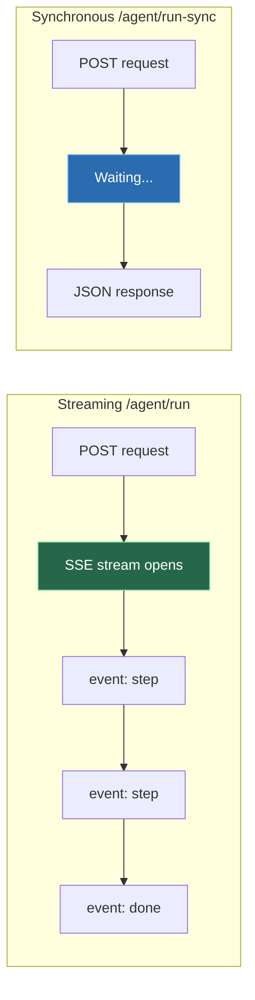
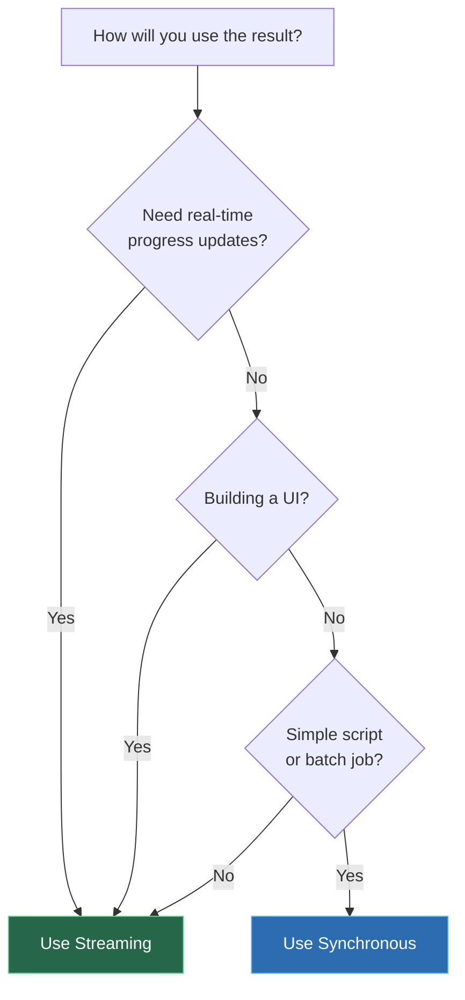

# Streaming vs Synchronous

Mobile Agent Studio offers two ways to run agent tasks. Choose based on your use case.



---

## At a glance

| | Streaming (`/agent/run`) | Synchronous (`/agent/run-sync`) |
|---|---|---|
| **Response** | SSE event stream | Single JSON object |
| **Real-time updates** | Yes — see each step live | No — waits until done |
| **Timeout** | Connection stays open | 10 minute max |
| **Best for** | UIs, dashboards, monitoring | Scripts, CI/CD, batch jobs |
| **Complexity** | Need SSE parser | Simple HTTP request |

---

## Synchronous — Simple and direct

Just POST and get the answer. No streaming to handle.

<!-- tabs:start -->

#### **Python**

```python
import requests

API = "http://localhost:3000/api/v1"
H = {"X-API-Key": "mas_your_key", "Content-Type": "application/json"}

result = requests.post(
    f"{API}/phones/phone-1/agent/run-sync",
    headers=H,
    json={"prompt": "What's the battery level?"},
).json()

if result["success"]:
    print(result["result"])   # "Battery is at 87%, charging."
    print(result["steps"])    # ["Opened Settings", "Found battery info"]
else:
    print(result["error"])    # "Could not connect to phone."
```

#### **JavaScript**

```javascript
const API = "http://localhost:3000/api/v1";
const H = { "X-API-Key": "mas_your_key", "Content-Type": "application/json" };

const result = await fetch(`${API}/phones/phone-1/agent/run-sync`, {
  method: "POST", headers: H,
  body: JSON.stringify({ prompt: "What's the battery level?" }),
}).then(r => r.json());

console.log(result.success ? result.result : result.error);
```

#### **curl**

```bash
curl -X POST http://localhost:3000/api/v1/phones/phone-1/agent/run-sync \
  -H "X-API-Key: mas_your_key" \
  -H "Content-Type: application/json" \
  -d '{"prompt": "What is the battery level?"}'
```

<!-- tabs:end -->

**Response shape:**

```json
{
  "success": true,
  "result": "Battery is at 87%, currently charging.",
  "steps": ["Opened Settings", "Navigated to Battery", "Read battery level"],
  "stepCount": 3,
  "error": null
}
```

---

## Streaming — Real-time events

For UIs and monitoring. Each event arrives as it happens.

<!-- tabs:start -->

#### **Python**

```python
import requests, json

API = "http://localhost:3000/api/v1"
H = {"X-API-Key": "mas_your_key", "Content-Type": "application/json"}

resp = requests.post(
    f"{API}/phones/phone-1/agent/run",
    headers=H,
    json={"prompt": "Install the Calculator app from Play Store"},
    stream=True,
)

for line in resp.iter_lines():
    line = line.decode()
    if not line.startswith("data: "):
        continue

    event = json.loads(line[6:])
    t = event["type"]
    m = event["message"]

    if t == "info":    print(f"  ℹ {m}")
    elif t == "step":  print(f"  → {m}")
    elif t == "done":  print(f"  ✓ {m}")
    elif t == "error": print(f"  ✗ {m}")
```

#### **JavaScript**

```javascript
const API = "http://localhost:3000/api/v1";
const H = { "X-API-Key": "mas_your_key", "Content-Type": "application/json" };

const resp = await fetch(`${API}/phones/phone-1/agent/run`, {
  method: "POST", headers: H,
  body: JSON.stringify({ prompt: "Install the Calculator app" }),
});

const reader = resp.body.getReader();
const decoder = new TextDecoder();
let buffer = "";

while (true) {
  const { done, value } = await reader.read();
  if (done) break;
  buffer += decoder.decode(value, { stream: true });
  const lines = buffer.split("\n");
  buffer = lines.pop();

  for (const line of lines) {
    if (!line.startsWith("data: ")) continue;
    const { type, message } = JSON.parse(line.slice(6));
    console.log(`[${type}] ${message}`);
  }
}
```

#### **curl**

```bash
# -N disables output buffering for real-time streaming
curl -N -X POST http://localhost:3000/api/v1/phones/phone-1/agent/run \
  -H "X-API-Key: mas_your_key" \
  -H "Content-Type: application/json" \
  -d '{"prompt": "Install the Calculator app"}'
```

<!-- tabs:end -->

**SSE event format:**

```
data: {"type":"info","message":"Connecting to device...","timestamp":"..."}

data: {"type":"step","message":"Opened Play Store","timestamp":"..."}

data: {"type":"step","message":"Searched for Calculator","timestamp":"..."}

data: {"type":"done","message":"Installed Calculator app successfully.","timestamp":"..."}
```

Each event is `data: {json}\n\n`. Event types:

| Type | Meaning |
|------|---------|
| `info` | Status update |
| `step` | Agent action or thought |
| `done` | Success — `message` contains the answer |
| `error` | Failure — `message` contains the reason |

---

## Reconnecting a stream

If you disconnect mid-task, the agent keeps running. Reconnect within 60 seconds:

```
GET /phones/:id/agent/stream
```

This replays all events from the start, then continues live.

```python
import requests

API = "http://localhost:3000/api/v1"
H = {"X-API-Key": "mas_your_key", "Content-Type": "application/json"}

# Check if still running
status = requests.get(f"{API}/phones/phone-1/agent/status", headers=H).json()
if status["running"]:
    resp = requests.get(f"{API}/phones/phone-1/agent/stream", headers=H, stream=True)
    # Read events same as /agent/run
```

---

## Which should I use?



**Use sync when:**
- You're writing a script that just needs the answer
- You're running batch jobs
- You don't need to show progress to a user
- You want the simplest integration

**Use streaming when:**
- You're building a UI that shows live progress
- You want to log each step as it happens
- The task might take a long time and you need heartbeat
- You want to react to intermediate steps
